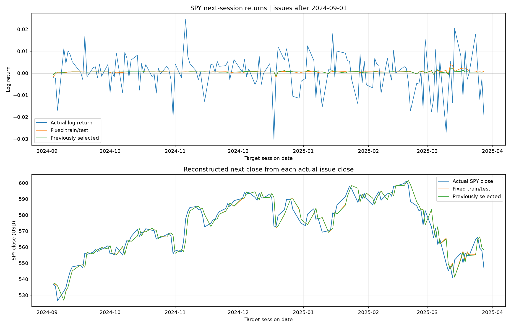

# My Trading System

Research experiments in financial time-series forecasting and portfolio allocation. The main project is **[Signature Price Forecast](Signature_Price_Forecast/)**, which studies whether signature transforms of recent price paths and quantitative market factors can predict the next trading session's SPY log return.

The repository also contains S&P 500 reinforcement-learning experiments, reference papers, and Transformer forecasting models.

## Signature Price Forecast

### Start here

- **[Project report](Signature_Price_Forecast/signature_price_forecast.ipynb)** — executed notebook covering the research question, data, model, chronological evaluation, and forecast plots.
- **[Train/test comparison](Signature_Price_Forecast/spy_train_test_comparison.ipynb)** — compares fixed default settings with the settings previously selected in the report, using the same rolling training windows and test dates.
- **[Detailed guide](Signature_Price_Forecast/README.md)** — data provenance, training calendar, reproduction notes, and result definitions.

### What the model does

At each completed session close, the model predicts one scalar: the next-session SPY log return, `log(next close / current close)`. The sign gives an up/down forecast. Price plots reconstruct each forecast from the preceding **actual** close; they are not a recursively simulated future price path.

The forecasting pipeline:

1. Build a recent SPY log-close path with time as an additional channel, and compute its truncated signature.
2. Screen quantitative factors against historical same-session SPY returns and remove highly collinear factors using the available training data.
3. Weight training examples by similarity to the current market path using a truncated signature kernel.
4. Use weighted Lasso to select features, then refit weighted ordinary least squares on those selected features.
5. Repeat the factor screen and full model fit on every forecast issue date, using only labels whose target closes have already occurred.

The default input combines six QQQ/IWM return, intraday-change, and volatility factors with thirteen FinMultiTime numeric price, market-breadth, and filing-table factors. News text and chart images are excluded from this signature experiment. Filing-table information becomes usable on the session after its filing date.

The workflow adapts [*Transportation Marketplace Rate Forecast Using Signature Transform*](Papers/Transportation%20Marketplace%20Rate%20Forecast%20Using%20Signature%20Transform.pdf). Here, “adaptive” refers to signature-based **sample weights**.

### Evaluation and saved results

| Item | Historical experiment |
|---|---|
| Common daily data | 2018-01-02 to 2025-03-28 |
| Lookback / prediction horizon | 20 sessions / one session ahead |
| Rolling training window | At most 756 examples with observed target closes |
| Validation issue dates | 2023-01-03 to 2023-12-29 |
| Test issue dates | 2024-01-02 to 2025-03-27; 310 forecasts |
| Test target close dates | 2024-01-03 to 2025-03-28 |

The report selects candidate settings by validation log-return mean absolute error (MAE). The comparison notebook evaluates fixed defaults and that previously selected configuration without a new validation search.

| Method | Test log-return MAE | Direction accuracy | Return correlation |
|---|---:|---:|---:|
| Signature model: report-selected settings | 0.00627737 | 58.71% | 0.01515 |
| Signature model: fixed defaults | 0.00627412 | 58.39% | 0.04401 |
| Zero-return / majority-direction diagnostics | 0.00633821 | 57.74% | — |

The baseline row combines two separate diagnostics: zero-return predictions for MAE and majority direction for accuracy. The report-selected model predicts up on 96.45% of test sessions, so its small accuracy advantage should be read alongside that imbalance and its low return correlation. The paired MAE difference interval includes zero; this sample does not clearly separate the two configurations.

These are historical forecasts through March 2025. The saved results do not establish a profitable trading strategy or live forecasting performance.

Browse [daily-refit outputs](Signature_Price_Forecast/results/daily_refit/) for predictions, metrics, selected-factor frequencies, and plots, or [comparison outputs](Signature_Price_Forecast/results/train_test_comparison/) for matched predictions, training calendars, and paired error analysis.



### Setup and reproduction

Install the project's dependencies in your Python environment from the repository root:

```powershell
python -m pip install -r Signature_Price_Forecast/requirements.txt
```

Open either notebook in a notebook editor using that environment (the original reports use the `Quant_ENV` kernel). The notebooks locate the project from either the repository root or the `Signature_Price_Forecast` folder.

**Data prerequisite:** the loader requires adjusted daily ETF files at `SP500/attention_data/SPY_daily.csv`, `QQQ_daily.csv`, and `IWM_daily.csv`, each with `date`, `open`, and `close` columns. These files are currently **not tracked in this repository**; a fresh clone needs them supplied separately. Use the original snapshots to reproduce the saved numbers; other snapshots may change the results. The default `USE_FINMULTITIME=True` also downloads and caches public numeric source archives on first use. Setting it to `False` uses only the local ETF factors and changes the experiment.

Run the focused mathematical and timing checks from the repository root:

```powershell
python -m unittest discover -s Signature_Price_Forecast/tests -v
```

Implementation is in [`src/spy_adaptive_lasso.py`](Signature_Price_Forecast/src/spy_adaptive_lasso.py). The `tools/` scripts build notebook templates; rebuilding removes saved notebook outputs.

## Other folders

| Folder | Purpose |
|---|---|
| **[SP500](SP500/README.md)** | Online actor-critic research that allocates between SPY exposure and cash, with chronological learning and modeled trading and financing costs. Start with [the notebook](SP500/online_sp500_rl.ipynb). |
| **[Papers](Papers/)** | Reference PDFs supporting the research, including signature methods, transportation rate forecasting, RAVEN, and the label-horizon paradox. |
| **[HF_Transformer](HF_Transformer/README.md)** | Transformer experiments for next-minute ETF direction and FinMultiTime next-day direction, including online updates and chronological tuning. Start with [the next-day tuning guide](HF_Transformer/finmultitime_tuning_guide.ipynb) or [the minute-model notebook](HF_Transformer/hf_transformer_online.ipynb). |